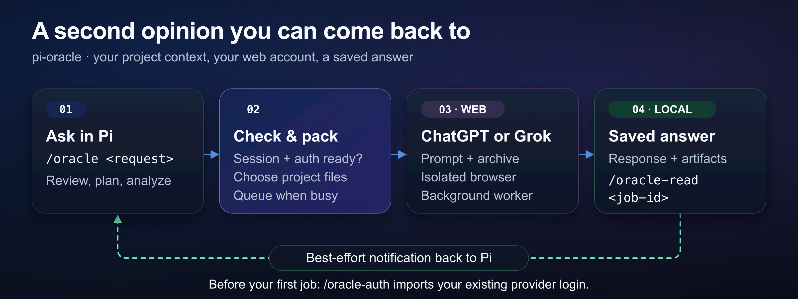

# pi-oracle

pi-oracle sends project files and questions from [Pi](https://github.com/earendil-works/pi) to ChatGPT or Grok through your web account. Each job uses an isolated browser and saves its answer locally.



## Install

Use Node.js 22.19.0 or newer on macOS, Linux, or Windows native. Use a current Pi release and a Chromium-family browser.

Install `agent-browser` and `tar`. Install `zstd` for ChatGPT jobs. Check the [platform requirements](docs/reference.md#requirements) for profile copies and encrypted cookies.

Install Oracle:

```bash
pi install npm:pi-oracle
```

Start a normal persisted `pi` session in your project directory:

```bash
pi
```

Oracle cannot submit jobs from `pi --no-session`.

## First job

Sign in to ChatGPT in your source browser profile. Your account must have access to the selected [preset](#settings).

Import your login into Oracle:

```text
/oracle-auth
```

Submit a small request:

```text
/oracle Read README.md and package.json. Explain what this package does.
```

Oracle checks session and authentication readiness before gathering files. It returns a job id and response path after dispatch.

Jobs can queue when browser capacity is full. Oracle sends a best-effort notification to the matching Pi session when a job finishes.

If no notification arrives, find the job and read its answer:

```text
/oracle-status
/oracle-read <job-id>
```

## Commands

| Command | Purpose |
| --- | --- |
| `/oracle <request>` | Submit a question with project files. |
| `/oracle-followup <job-id> <request>` | Continue the same provider thread. |
| `/oracle-auth [chatgpt\|grok]` | Import a provider login from your source browser profile. |
| `/oracle-read [job-id]` | Show status and a saved answer preview. |
| `/oracle-status [job-id]` | Show status and recent job ids when no explicit id is given. |
| `/oracle-cancel <job-id>` | Cancel a queued or active job. |
| `/oracle-clean <job-id\|all>` | Delete finished-job files. A recent notification can delay cleanup; retry at the time shown. |

Normal `/oracle` jobs start a fresh provider thread. To continue an existing ChatGPT conversation, include its id or URL in your request.

Answers, logs and artifacts use `${PI_ORACLE_JOBS_DIR:-/tmp}/oracle-<job-id>/`.

By default, Oracle deletes completed and cancelled jobs after 14 days. It deletes failed jobs after 30 days. Copy files you need to keep. See [retention settings](docs/reference.md#job-retention) for details.

## Settings

Oracle uses ChatGPT and the `pro_extended` preset by default. Change the defaults in `~/.pi/agent/extensions/oracle.json`:

```json
{
  "defaults": {
    "provider": "chatgpt",
    "preset": "thinking_light"
  }
}
```

For Grok, run `/oracle-auth grok` first. Name Grok in your `/oracle` request. Grok supports Heavy only.

ChatGPT accepts archives up to 250 MiB; Grok accepts up to 200 MiB. See [providers and presets](docs/reference.md#available-providers-and-presets) for archive formats, preset ids and model-picker limits.

Browser and authentication settings use the agent-level config. See [configuration](docs/reference.md#configuration) for project trust rules and custom cookie sources.

To update Oracle, run `pi update npm:pi-oracle`. See [installation options](docs/reference.md#installation-options) for GitHub installs and other update commands.

## Limits and privacy

**Experimental public beta.** Provider pages can change and cause jobs to fail. Check [troubleshooting](docs/reference.md#troubleshooting) if authentication or a job fails.

**Oracle uploads project files to ChatGPT or Grok.** The agent chooses the files. It adds nearby files for context and can send the whole repository for broad or unclear requests.

Default exclusions do not guarantee that an archive contains no sensitive data. Specify an exact file list for private material. Tell the agent to exclude all other files.

Oracle reads provider cookies from your source browser profile. It copies the login into an isolated profile for each job.

Cookie imports do not preserve host-only or partitioned-cookie isolation metadata. Keep browser safe-storage passwords out of project config and shell startup files.

## Details

- [Reference](docs/reference.md): examples, commands, presets, authentication setup and troubleshooting.
- [Design](docs/ORACLE_DESIGN.md): archives, queue, job state and notifications.
- [Development](docs/development.md): checks, host compatibility and release gates.
- [Report a problem](https://github.com/fitchmultz/pi-oracle/issues). Remove sensitive data from job diagnostics before you share them.

## License

MIT. See [LICENSE](LICENSE).
